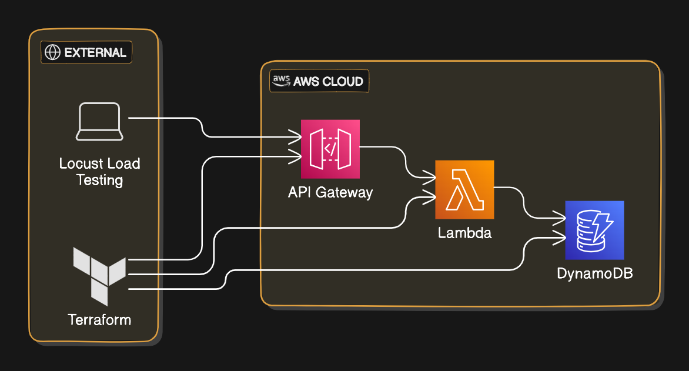

README for Locust Load Testing with AWS Serverless: Building Infrastructure with Terraform - Article 2

Locust Automated Setup Guide
This repository contains scripts referenced in the LinkedIn article on automating the setup of a serverless API using AWS Lambda, API Gateway, and DynamoDB, followed by load testing with Locust.

Overview
In the article, we cover:

Automating a Serverless Architecture: Setting up an API with AWS Lambda, API Gateway, and DynamoDB using Terraform.
Performing Load Testing: Using Locust to simulate user load and evaluate the performance of your API.
Analyzing Results: Viewing real-time load test results via a web interface.
Understanding Component Connections: Learning how Lambda, API Gateway, and DynamoDB work together seamlessly.
Impact of Different Configurations: Demonstrating how changing Lambda configurations affects API performance.
Read the Full Article
For detailed instructions and insights, please refer to the full article on LinkedIn: Locust Load Testing with AWS Serverless: Building Infrastructure with Terraform

Repository Contents
main.tf: Defines the primary configuration for the infrastructure, including the resources and their properties.
iam.tf: Manages IAM roles, policies, and attachments for secure access control.
lambda.tf: Defines the AWS Lambda functions and their configuration.
api_gateway.tf: Sets up the API Gateway to handle HTTP requests and route them to Lambda functions.
dynamodb.tf: Configures the DynamoDB tables used for data storage.
outputs.tf: Specifies the outputs that will be displayed after the infrastructure is applied.
lambda_function.py: Python script for the AWS Lambda function.
locustfile.py: Load testing script for Locust.
Feel free to explore the scripts and reach out if you have any questions or need further assistance.